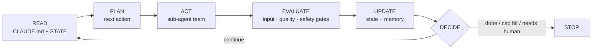

<div align="center">

# 🛰️ Orbit

### Stop prompting your agent. Build a system that prompts itself.

Orbit turns any product repo into a **self-prompting agentic loop** — persistent memory,
a specialized sub-agent team, packaged skills, and a real run→evaluate→decide loop with
**hard brakes** so it can never run away on cost or do something irreversible on its own.

One command sets it up. It runs on your own orchestrator. It updates itself.

<br/>


</div>

---

> **"You're not supposed to prompt Claude. You're supposed to build a system that prompts itself."**
> — Daisy Hollman

A single prompt runs once and the context evaporates. A **system** keeps its own state,
splits its own work across specialists, checks its own results against a bar it set, writes
down what it learned, and decides its own next move — safely, inside hard limits, with a
human at the gates that matter. Orbit installs that system into your repo in one shot.

## The loop



`DECIDE` is the brake — it runs every cycle and is the only place the loop is allowed to
keep going. Hit an iteration / token / cost / runtime cap, fail a gate too many times, or
reach an explicit "done", and it stops cleanly.

## What you get

Run `/orbit` in a repo and it audits the project, then scaffolds two layers:

**🧠 Model-agnostic core** — runs on *your* orchestrator (e.g. Gemini), in cron, or in CI:
- `CLAUDE.md` — the single source of truth, read at the start of every cycle
- `.orbit/STATE.md` — mutable working memory (task queue, decisions, blockers)
- `.orbit/roles/*.md` — a specialized sub-agent team any model can adopt
- `.orbit/skills/*.md` — packaged domain knowledge, loaded on demand
- `.orbit/loop.config.json` — the safety contract (caps, gates, checkpoints)
- `.orbit/loop.py` — a reference runner; wire its one `dispatch()` seam to your model

**🔌 Claude Code adapter** — so the same system runs natively here:
- `.claude/agents/*.md` — the roles as Claude Code subagents
- `.claude/settings.json` hooks — automated validation on key events
- `scripts/ralph_loop.sh` — a fresh-context "Ralph loop" driving headless `claude -p`

**The team** it stands up: an **Orchestrator** that plans and delegates, the **specialists**
your domain needs, a **Safety gate** with veto power, a **Reviewer gate** that decides what
counts as progress, and a **Reporter**. No single agent does everything.

## Install

### Option A — Plugin marketplace (recommended)

Inside Claude Code, run these two prompts:

```text
/plugin marketplace add Abdulaziz-almoshen/orbit
/plugin install orbit@orbit
```

That registers two commands: **`/orbit`** and **`/orbit-upgrade`**.

### Option B — Clone (for hacking on it, or air-gapped installs)

```bash
git clone https://github.com/Abdulaziz-almoshen/orbit.git
```

Then point Claude Code at the local copy:

```text
/plugin marketplace add ./orbit
/plugin install orbit@orbit
```

## Use

In the product repo you want to upgrade, run:

```text
/orbit
```

It asks a couple of questions to characterize your domain (or infers them from the repo),
audits the current state, scaffolds the whole system, and recommends a safe first loop to
run — start small, dry-run, every checkpoint set to human, watch it stop on its own.

### One mental model that matters

- **`/orbit` is a one-time installer.** Like a setup wizard: you run it, it does its work,
  it ends, and you're back to normal Claude. It does **not** intercept every later message.
- **The always-on part is what it installs** — the `CLAUDE.md` (auto-loaded every session)
  and hooks act as standing guardrails.
- **The continuous part is the loop runner** (`.orbit/loop.py` / `scripts/ralph_loop.sh`).
  You launch it deliberately when you want the system to run autonomously for N cycles — and
  it stops itself at the stop conditions.

## Self-update (the gstack way)

Every time you run `/orbit`, a preamble quietly checks GitHub for a newer version (throttled
to once a day). If there's one, it offers to upgrade and then continues. You can also:

```text
/orbit-upgrade               # git pull + "what's new", with auto-upgrade / snooze options
/plugin update orbit@orbit   # the platform's built-in updater
```

Want it fully hands-off? Add `auto_upgrade=true` to `~/.orbit/config`.

> **Scope of an update:** upgrading changes the **plugin only**. The `CLAUDE.md`, roles, and
> loop files a previous run wrote into a product repo are *that project's files* and are never
> touched. To pull template improvements into an existing project, re-run `/orbit` — it
> merges, it doesn't clobber.

## Safety is not optional

The scaffolded loop **never** takes an irreversible, financial, or outward-facing action on
its own — it proposes; a human disposes. `move_money` is `FORBIDDEN` by default, side effects
route through human-approval checkpoints, and the loop defaults to dry-run / sandbox. A loop
without hard caps is a defect, so Orbit always installs them — even if you ask it not to.

## Repo layout

```
orbit/                              ← this repo = the plugin
├── .claude-plugin/
│   ├── plugin.json                 # manifest (name, version)
│   └── marketplace.json            # marketplace catalog
├── VERSION                         # single source of truth for the version
├── CHANGELOG.md                    # what "what's new" reads from
├── bin/
│   └── orbit-update-check          # prints UPGRADE_AVAILABLE / JUST_UPGRADED / nothing
└── skills/
    ├── orbit/                      # the main skill
    │   ├── SKILL.md
    │   ├── references/             # methodology, templates, roles, loop design, profile
    │   ├── assets/                 # copyable loop.py, loop.config.json, ralph_loop.sh
    │   ├── scripts/scaffold.py     # lays down the deterministic skeleton
    │   └── evals/                  # test cases (for contributors)
    └── orbit-upgrade/
        └── SKILL.md                # the self-update flow
```

## Releasing a new version

1. Make changes under `skills/`.
2. Bump the version in **both** `VERSION` and `.claude-plugin/plugin.json` (keep them equal —
   the update checker compares `VERSION`).
3. Add a `CHANGELOG.md` entry.
4. `git push` to `main`. Installed users get the offer on their next `/orbit`, or immediately
   via `/orbit-upgrade`.

## License

MIT © [Abdulaziz Almohsen](https://github.com/Abdulaziz-almoshen)

<div align="center">
<br/>
Built on Daisy Hollman's "build a system that prompts itself." Now go put something in orbit. 🛰️
</div>
