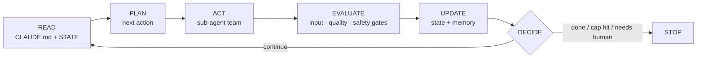

<div align="center">

# 🛰️ Orbit

### Stop prompting your agent. Build a system that prompts itself.

Orbit turns any product repo into a **self-prompting agentic loop** — persistent memory,
a specialized sub-agent team, packaged skills, and a real run→evaluate→decide loop with
**hard brakes** so it can never run away on cost or do something irreversible on its own.

One command sets it up. It runs on your own orchestrator. It updates itself.

<br/>


</div>

---

> **"You're not supposed to prompt Claude. You're supposed to build a system that prompts itself."**
> — Daisy Hollman

Right now you **babysit** your AI: re-explaining the project every session, watching it
drift, never quite sure what it's doing — or whether it'll do something it can't undo. Orbit
ends that. It turns your repo into a **system that runs itself**: it remembers, it routes
your work through a small team of specialists that check each other, it shows you who's
doing what **live**, and it **physically can't run away or wreck your project**. One command
sets it up — it reads your repo and asks almost nothing.

## Why you'll care

| Without Orbit | With Orbit |
|---|---|
| Re-explain your project every chat | It **remembers** — goals, decisions, conventions, progress (in `CLAUDE.md` + `STATE.md`) |
| One agent does everything, you catch the mess later | A **team** — plan → build → **safety gate** → **quality gate** — that checks its own work |
| A wall of text; you're not sure what's happening | A **live checklist** of who's working, crossing itself off as it goes |
| It free-edits, force-pushes, maybe breaks your DB | A guard **physically blocks** the catastrophic; irreversible actions are *proposed*, never done alone |
| A crash → it starts over and re-burns tokens | **Checkpointed** — it resumes from the last finished step |
| It does exactly what you typed, bugs and all | It's **smarter than the prompt** — clarifies, challenges weak assumptions, proposes a better approach |

You ask for a **task** → it runs the loop. You ask a **question** → it just answers. That's
the whole idea: *a system that prompts itself*, so you stop hand-holding and start shipping.

## The loop

Every cycle is the same honest shape — and you can watch each step happen:




`DECIDE` is the brake — it runs every cycle and is the only place the loop is allowed to
keep going. Hit an iteration / token / cost / runtime cap, fail a gate too many times, or
reach an explicit "done", and it stops cleanly.

## 👀 Watch it work — see *who's talking*, live

This is the part people love. No black box: at any moment you see **which agent is talking,
what stage it's in, and the checklist crossing itself off** — like watching a small team work.
Every role announces itself; one event stream feeds the views below.

**In Claude Code (default)** — the checklist is built with the native **`TaskCreate` /
`TaskUpdate`** tools (the pinned list your IDE keeps on screen; these replaced the now-default-off
`TodoWrite`). The main orchestrator drives it — each item tagged with the role that owns it and
struck through the instant it finishes. Orbit also mirrors it to `.orbit/tasks.json` every cycle,
so if the task tools aren't called you can still see it via `orbit-status` (below):

```text
  ✔ [orchestrator] plan cycle 1
  ✔ [data]         validate inputs
  ▸ [analyst]      derive candidate output     ← in progress
  ☐ [safety]       gate the output
  ☐ [reviewer]     check vs success criteria
```

**Headless only — your own orchestrator (Gemini, cron, CI)** — there's no chat to pin a
checklist into, so run `scripts/orbit-status --follow` for a live, color-coded dashboard
(press **Ctrl-C** to stop):

```text
🛰  ORBIT — live status   .orbit

Checklist
  ✓ [orchestrator] plan cycle 1
  ✓ [data]         validate inputs
  ▸ [analyst]      derive candidate output
  ○ [safety]       gate the output
  ○ [reviewer]     check vs success criteria

Now  [analyst] act — scoring 412 validated rows

Thread (who said what)
  20:14:02 ✓ [orchestrator] plan: planned 5 tasks for cycle 1
  20:14:09 ▸ [data]         act: fetching + validating inputs
  20:14:15 ✓ [data]         act: 412 rows, schema OK
  20:14:15 ▸ [analyst]      act: scoring 412 validated rows
```

Both views read **one source of truth** — `.orbit/activity.jsonl` (the who·phase·what event
stream) + `.orbit/tasks.json` (the checklist) — so a web panel or IDE view can plug into the
same stream later with zero loop changes. And when the loop pauses for you, the dashboard
says so loudly: `[human] awaiting approval: publish to CMS`.

## What you get

Run `/orbit` in a repo and it audits the project, then scaffolds two layers:

**🧠 Model-agnostic core** — runs on *your* orchestrator (e.g. Gemini), in cron, or in CI:
- `CLAUDE.md` — the single source of truth, read at the start of every cycle
- `.orbit/STATE.md` — mutable working memory (task queue, decisions, blockers)
- `.orbit/roles/*.md` — a specialized sub-agent team any model can adopt
- `.orbit/skills/*.md` — packaged domain knowledge, loaded on demand
- `.orbit/loop.config.json` — the safety contract (caps, gates, checkpoints)
- `.orbit/loop.py` — a reference runner; wire its one `dispatch()` seam to your model
- `.orbit/activity.py` + `scripts/orbit-status` — the **observability layer**: a who·phase·what
  event stream and the live `orbit-status --follow` dashboard (see the "Watch it work" section above)

**🔌 Claude Code adapter** — so the same system runs natively here:
- `.claude/agents/*.md` — the roles as Claude Code subagents
- `.claude/settings.json` hooks — automated validation on key events
- `scripts/ralph_loop.sh` — a fresh-context "Ralph loop" driving headless `claude -p`
- **native TaskCreate/TaskUpdate checklist** — the pinned, auto-crossed-off list, role-tagged per item

**The team** it stands up: an **Orchestrator** that plans and delegates, the **specialists**
your domain needs, a **Safety gate** with veto power, a **Reviewer gate** that decides what
counts as progress, and a **Reporter**. No single agent does everything.

## Install

### Option A — Paste this prompt, let Claude install it (easiest)

Open Claude Code and paste this:

```text
Install the "Orbit" Claude Code plugin for me. Run these shell commands and show the output:

  claude plugin marketplace add Abdulaziz-almoshen/orbit
  claude plugin install orbit@orbit
  claude plugin list

Confirm "orbit@orbit" shows as enabled, then tell me to restart Claude Code so the /orbit
and /orbit-upgrade commands load. Do NOT edit any project files and do NOT make any git
commits — installation is user-scoped and self-contained.
```

That's the whole install — it's user-scoped, so `/orbit` and `/orbit-upgrade` work in every
project after a restart.

**Want teammates to get it on a shared project too?** After installing, ask Claude:
*"add Orbit to this project for teammates"*. It runs the install with `--scope project`,
which writes `.claude/settings.json` — and then **you** review and commit that file. Orbit
never commits to your repo for you.

### Option B — Run the commands yourself (marketplace)

Inside Claude Code, run these two prompts:

```text
/plugin marketplace add Abdulaziz-almoshen/orbit
/plugin install orbit@orbit
```

Either way you get two commands: **`/orbit`** and **`/orbit-upgrade`**.

### Option C — Clone (for hacking on it, or air-gapped installs)

```bash
git clone https://github.com/Abdulaziz-almoshen/orbit.git
```

Then point Claude Code at the local copy:

```text
/plugin marketplace add ./orbit
/plugin install orbit@orbit
```

## Use

**Set it up once** — in the product repo, run:

```text
/orbit
```

It **reads your repo to characterize the domain itself** (stack, goal, what's risky) and
asks **at most one** product question — usually **none** on an existing repo; it only asks
on a blank/greenfield project where there's nothing to infer. Then it scaffolds the system
and installs the routing rule.

**After that, it's a task router.** A rule in your `CLAUDE.md` (read every session) tells
Claude to:
- **route a *task*** ("add a logout button", "fix this bug", "port this screen") **through
  the loop** — read state → plan → act via the roles → gates → update — or you can kick one
  off explicitly with **`/orbit:orbit-run <task>`**;
- **answer a *question*** ("is the project live?", "what does X do?") **directly**, no loop.

This is what "a system that prompts itself" means: the plugin drives the next step, you're
not feeding it one prompt at a time.

> **Honest about what binds:** the routing rule is **advisory** — Claude follows it, but no
> tool can *force* a workflow to run on a given message (gstack's routing is advisory too).
> The one thing that truly **binds** is the optional §6a **safety hook** (it blocks/asks
> before dangerous commands, in or out of the loop). So: routing = reliable discipline,
> safety hook = the hard wall. For unattended/multi-step runs, launch the loop yourself
> (`scripts/ralph_loop.sh`, dev) or a durable engine (production).

### Dev runner vs. durable production

A loop that can't survive a restart isn't a loop — it re-fetches, re-calls the model
(re-burning tokens), and can double-fire side effects. So be honest about the two runners:

- **`scripts/ralph_loop.sh` — dev.** Fresh `claude -p` per cycle; great for building and
  watching. **Not durable:** a crash restarts the cycle.
- **A durable engine — production.** Run on Inngest / Temporal / Vercel Workflow for step
  checkpointing, retries, `onFailure`, cron/event triggers, and concurrency. `loop.py` adds
  portable checkpointing (`--resume`); the seam and a reference template
  ([`assets/runners/inngest-loop.ts`](skills/orbit/assets/runners/inngest-loop.ts)) are
  included. Orbit brings the **system design + safety + onboarding**; the engine brings the
  **durability** — don't reinvent it. See
  [`durable-execution.md`](skills/orbit/references/durable-execution.md).

> Vocabulary note: Orbit's `.orbit/skills/*.md` are **knowledge playbooks** (reference a role
> loads), distinct from a "durable skill" (a retryable workflow on the engine).

## Self-update

Every time you run `/orbit`, a preamble quietly checks GitHub for a newer version (throttled
to once a day). If there's one, it offers to upgrade and then continues. You can also:

```text
/orbit-upgrade               # git pull + "what's new", with auto-upgrade / snooze options
/plugin update orbit@orbit   # the platform's built-in updater
```

Want it fully hands-off? Add `auto_upgrade=true` to `~/.orbit/config`.

> **Scope of an update:** upgrading changes the **plugin only**. The `CLAUDE.md`, roles, and
> loop files a previous run wrote into a product repo are *that project's files* and are never
> touched. To pull template improvements into an existing project, re-run `/orbit` — it
> merges, it doesn't clobber.

## Safety — what binds, and what doesn't

Be clear-eyed about where the guarantees are:

- **Inside the loop** (`loop.py` / `ralph_loop.sh`): hard caps always apply (iterations,
  tokens, cost, runtime), `move_money` is `FORBIDDEN`, and side effects route through
  human-approval checkpoints. The loop proposes; a human disposes. This part is enforced by
  the runner.
- **Routing + roles are advisory.** The §10 routing rule and the roles are *guidance* the
  model follows reliably (gstack-level), but no tool can *force* them — so they're discipline,
  not a wall.
- **The wall is the safety hook — and `/orbit` installs it by default.** The always-on
  **`PreToolUse` hook** makes your non-negotiables (e.g. force-push, a schema migration,
  pushing a secrets branch) bind on *every* command, loop or not — the harness runs it before
  the tool and can `deny`. It's the one thing the agent can't talk its way around. `/orbit`
  wires it as part of setup and **tells you exactly what it added** (it denies the
  catastrophic, only *asks* on normal pushes, and **fails open** so it never bricks your
  shell). Not silent, not opt-in-and-forgotten.

Everything Orbit adds — including the hook — is removable with `orbit-uninstall`.

## Repo layout

```
orbit/                              ← this repo = the plugin
├── .claude-plugin/
│   ├── plugin.json                 # manifest (name, version)
│   └── marketplace.json            # marketplace catalog
├── VERSION                         # single source of truth for the version
├── CHANGELOG.md                    # what "what's new" reads from
├── bin/
│   ├── orbit-update-check          # prints UPGRADE_AVAILABLE / JUST_UPGRADED / nothing
│   └── orbit-uninstall             # removes the Orbit scaffold from a product repo
└── skills/
    ├── orbit/                      # the main skill
    │   ├── SKILL.md
    │   ├── references/             # methodology, templates, roles, loop design,
    │   │                           #   observability, hooks/enforcement, profile
    │   ├── assets/                 # loop.py, loop.config.json, activity.py, ralph_loop.sh,
    │   │                           #   orbit-status, checks/guard.py, example subagent
    │   ├── scripts/scaffold.py     # lays down the deterministic skeleton
    │   └── evals/                  # test cases (for contributors)
    └── orbit-upgrade/
        └── SKILL.md                # the self-update flow
```

## Releasing a new version

1. Make changes under `skills/`.
2. Bump the version in **both** `VERSION` and `.claude-plugin/plugin.json` (keep them equal —
   the update checker compares `VERSION`).
3. Add a `CHANGELOG.md` entry.
4. `git push` to `main`. Installed users get the offer on their next `/orbit`, or immediately
   via `/orbit-upgrade`.

## License

MIT © [Abdulaziz Almohsen](https://github.com/Abdulaziz-almoshen)

<div align="center">
<br/>
Built on Daisy Hollman's "build a system that prompts itself." Now go put something in orbit. 🛰️
</div>
