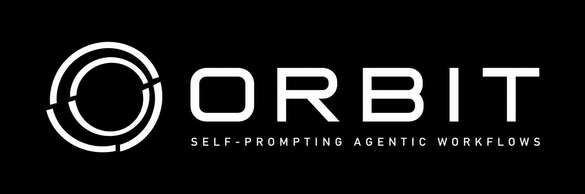
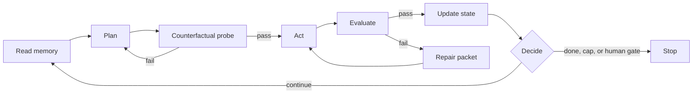

<p align="center">
  
</p>

<div align="center">

# Orbit

### Stop prompting your agent. Build a system that prompts itself.

Orbit turns a product repository into a durable, observable agentic loop: it remembers the work,
plans the next move, delegates focused tasks, checks the result, repairs failures, and stops at
hard safety and budget boundaries.


</div>

## Why Orbit

Most agent sessions forget context, repeat failed work, and leave you watching a black box. Orbit
gives the work a durable operating system:

- **Memory:** project goals, decisions, conventions, and progress persist in `CLAUDE.md` and `.orbit/STATE.md`.
- **Plan and progress:** every run has a visible checklist, owner, phase, gate, and next action.
- **Iterative quality:** failures become evidence-backed repair packets and return to the loop.
- **Independent QA:** an opt-in second provider reviews an exact commit against an armed acceptance
  manifest; code or manifest changes invalidate the approval.
- **Reviewer choice:** install-time detection offers Codex, isolated Claude QA, or both. Missing providers
  block instead of silently weakening the gate; the choice never grants project export consent, and
  Arabic/RTL QA follows the project, not the provider.
- **Adversarial thinking:** a cheap counterfactual probe challenges risky assumptions before build.
- **Model discipline:** Sonnet handles normal work; the Opus 4.8 Advisor is invoked on demand for
  expensive decisions.
- **Cost control:** token, dollar, runtime, context, iteration, and fan-out limits are explicit.
- **Parallel work:** independent workers use isolated Git worktrees instead of fighting over one checkout.
- **Safety:** catastrophic commands are blocked; risky operations pause for approval.

## The loop



Two gates make the loop meaningfully iterative:

1. **Counterfactual preflight:** identify the riskiest assumption, run the cheapest useful probe,
   and backtrack to discovery or planning when evidence disagrees.
2. **Bounded repair:** capture the failure, owner, root cause, required change, and regression test;
   repair it and return to the original gate. Repeated failure escalates to Advisor or a human.

## Install

Choose one installation path. Do not install both the clone and marketplace plugin.

```bash
git clone --single-branch --depth 1 https://github.com/Abdulaziz-almoshen/orbit.git \
  ~/.claude/skills/orbit
cd ~/.claude/skills/orbit && ./setup
```

Or:

```bash
curl -fsSL https://raw.githubusercontent.com/Abdulaziz-almoshen/orbit/main/install.sh | bash
```

Then open a product repository and run `/orbit`. The preamble checks for updates and quietly repairs
safe scaffold drift: it adds missing Orbit-owned files, preserves custom files and disabled hooks,
and skips projects under an active writer lock.

## Command map

| Command | Purpose |
|---|---|
| `/orbit` | Scaffold a project or merge safe template updates. |
| `/orbit:orbit-run <task>` | Force a task through the governed loop. |
| `scripts/orbit-status --follow` | Follow agents, checklist, gates, budget, and confidence. |
| `scripts/orbit-dashboard --once` | Print the redacted status snapshot; `--port N` serves a read-only board. |
| `scripts/orbit-pet start` | Show the always-on-top macOS pet that narrates tasks, questions, QA, commits, and deployment. |
| `scaffold.py --enable-reporter` | One-time trusted-project activation: hooks, terminal QA scene, local board, and macOS pet. |
| `scripts/orbit-qa-hook install` | Opt in to automatic post-commit QA and the exact-commit pre-push gate after project approval. |
| `orbit-doctor` | Inspect scaffold drift; `--fix` applies only safe managed-hook refreshes. |
| `scripts/orbit-lock status` | Inspect the current checkout lease. |
| `scripts/orbit-lock takeover --reason "..."` | Atomically break, acquire, and verify a handoff. |
| `scripts/orbit-worktree create --task <slug>` | Create an isolated worker branch and checkout. |
| `scripts/orbit-worktree finish <worktree>` | Submit changed files, tests, summary, and budget to the merge queue. |
| `scripts/orbit-memory review` | Review the learning ledger before promoting anything durable. |
| `/orbit-upgrade` | Upgrade the installed plugin. |

## Parallel work

The coordinator owns the plan, integration branch, `STATE.md`, and final QA. Workers write in separate
branches:

```text
Coordinator: plan -> integrate -> verify
     |-- orbit/task-a  -> worker + private worktree
     `-- orbit/task-b  -> worker + private worktree
```

Each worker receives a bounded token/USD reservation and returns a completion packet. The shared
registry lives in Git's common directory; each worktree has its own local Orbit lease. This means
parallel sessions are normal without allowing two sessions to edit the same checkout.

```bash
scripts/orbit-worktree create --task concierge-fix
scripts/orbit-worktree status
scripts/orbit-worktree finish ../project-orbit-concierge-fix \
  --summary "Implemented and tested the concierge fix" \
  --tests "pytest -q"
```

The coordinator reviews the packet, resolves conflicts, runs integration QA, and merges. Orbit does
not silently merge worker branches.

## Live visibility

Orbit is designed to be watched without reading a wall of model prose:

```text
Orbit  |  Build  |  3/8 complete  |  1 active  |  budget $0.42/$1.25

> frontend-engineer  building the requested slice
  reviewer            queued: checks regressions
  safety-gate         queued: confirms approval boundaries
```

In Claude Code, the native checklist is the primary surface. In headless or portable runs, use
`scripts/orbit-status --follow` or the read-only dashboard.

## What binds

| Capability | Guarantee |
|---|---|
| Safety wall | Trusted guard blocks force-push, destructive root/system deletes, disk wipes, and similar catastrophic commands. |
| Writer lease | One writer per checkout; reads remain available. `takeover` verifies the new owner before writes resume. |
| Worktree isolation | Separate workers can write concurrently in separate Git worktrees. |
| Runtime and budget caps | `ralph_loop.sh` and `loop.py` enforce iteration, runtime, token, and dollar limits. |
| Checkpointing | Durable runner state persists budget and progress across resume. |
| Telemetry | Hooks observe and redact activity; they fail open and never block work. |

The following remain model-governed rather than mechanically guaranteed: discovery depth, plan quality,
review judgment, when to invoke the Advisor, and the portable runner's model `dispatch()` seam. The
Claude Code path is the complete default path; wire `dispatch()` before using `loop.py` with another
orchestrator.

## Model and cost policy

Orbit Lite is the default:

- one primary executor and at most one unapproved sub-agent;
- maximum two isolated workers by default;
- focused packets instead of full repository history and telemetry;
- Sonnet for ordinary work;
- one Opus Advisor call for an architectural fork, safety uncertainty, or repeated gate failure;
- explicit per-cycle and per-run token, dollar, runtime, and context limits.

The goal is not maximum agent count. It is the smallest team that can produce convincing proof.

## Frontend projects

UI repositories receive a Designer lane, a 67-style design catalog, prototype-before-build guidance,
and visual QA helpers. The design gate records the chosen direction and asks when a UI change has no
design decision on record; it does not pretend to judge visual quality mechanically.

## Self-update

```text
/orbit-upgrade
```

The installer reports the resolved commit and version. Project scaffolds are separate snapshots; the
automatic preamble refreshes only safe Orbit-owned drift and never overwrites custom project files.

For a manual install refresh:

```bash
cd ~/.claude/skills/orbit
git fetch origin
git reset --hard origin/main
./setup
```

## Repository layout

```text
bin/                  trusted commands and hooks
assets/               scaffolded engines, checks, agents, and wrappers
references/           playbooks, role specs, and templates
scripts/scaffold.py   deterministic project provisioning and migration
tests/                regression, safety, budget, and lifecycle tests
```

## Development

```bash
python3 tests/run.sh
python3 scripts/check-coherence.py
python3 bin/orbit-verify --root .
```

Before a release, bump `VERSION`, add a `CHANGELOG.md` entry, regenerate `checksums.txt`, and run the
full suite. The current channel is an unsigned development channel; checksum verification detects
modification but is not a cryptographic signature.

## License

MIT
