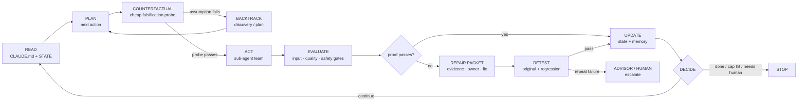

<div align="center">

# 🛰️ Orbit

### Stop prompting your agent. Build a system that prompts itself.

Orbit turns any product repo into a **self-prompting agentic loop** — persistent memory,
a specialized sub-agent team, packaged skills, and a real run→evaluate→decide loop with
**real brakes**: a PreToolUse hook that blocks catastrophic git commands, iteration/runtime
caps that bind the loop, and token/cost budgets metered on the runner. It also attacks risky
assumptions before implementation and turns review failures into bounded, evidence-backed repairs.

One command sets it up. It runs today on Claude Code's own sub-agents; a portable runner with the
same durability/budget logic is included for your own orchestrator, one function-wire away. It
updates itself.

<br/>


</div>

### Automatic scaffold self-heal

Every `/orbit` preamble performs a quiet, safe local refresh when it enters an Orbit-scaffolded
project. It adds missing Orbit-owned files, carries forward managed checks only when their provenance
proves they are unchanged, and keeps `setup.json` current. It does not touch project settings,
customized files, or a repository under another Orbit writer lock, so deliberate hook removals remain
removed. No separate doctor or refresh command is required for this baseline repair.

---

> **"You're not supposed to prompt Claude. You're supposed to build a system that prompts itself."**
> — Daisy Hollman

Right now you **babysit** your AI: re-explaining the project every session, watching it
drift, never quite sure what it's doing — or whether it'll do something it can't undo. Orbit
ends that. It turns your repo into a **system that runs itself**: it remembers, it routes
your work through a small team of specialists that check each other, it shows you who's
doing what **live**, and a **safety hook blocks the catastrophic** (force-push, `rm -rf` of a
root/system path, a disk wipe) and pauses on the risky (a plain push, `reset --hard`) before it
runs. One command sets it up — it reads your repo and asks almost nothing.
(What binds vs. what's advisory is spelled out honestly in [Safety](#safety--what-binds-and-what-doesnt).)

> **Works today vs. needs one wire-up.** The Claude Code path — the sub-agent team, the safety
> hook, the router — works out of the box. The portable `loop.py` runner (for your own
> orchestrator, e.g. Gemini) has real durable checkpointing, budget tracking, and approval
> enforcement — but its model seam, `dispatch()`, is an **honest stub that raises** until you wire
> it to your own model. Don't let the pitch above read as "drop-in on day one" for that path; see
> the [binds/advisory/stub table](#safety--what-binds-and-what-doesnt) for the full breakdown.

## Install

```bash
git clone --single-branch --depth 1 https://github.com/Abdulaziz-almoshen/orbit.git \
  ~/.claude/skills/orbit && cd ~/.claude/skills/orbit && ./setup
```

`/orbit` is available right away — no restart (it's a live-discovered user skill). Prefer `curl`?
`curl -fsSL https://raw.githubusercontent.com/Abdulaziz-almoshen/orbit/main/install.sh | bash` runs
the exact same clone + `./setup`. More options (marketplace plugin, "let Claude do it") are in
[Install options](#install-options).

> [!IMPORTANT]
> **Pick ONE install path.** Orbit is both a user skill (the clone above) *and* a Claude Code
> marketplace plugin. Installing it **both** ways gives you two copies of `/orbit` that both try to
> load — pick one and stick with it. The clone is the default; the marketplace path is in
> [Install options](#install-options).

### Command map

| Command | Where it runs | What it does |
|---|---|---|
| `/orbit` | In a product repo | Scaffold the governed loop, or merge template updates into an already-scaffolded repo |
| `/orbit:orbit-run <task>` | In a product repo | Force a task through the loop explicitly, bypassing the router's default-lane classification |
| `scripts/orbit-status --follow` | In a product repo (terminal) | Live who's-talking dashboard — the headless-runner equivalent of the pinned Claude Code checklist |
| `scripts/orbit-dashboard` [`--port N`] | In a product repo | The same board as a **read-only local web app** (plan · agents · owner · gates · budget · confidence · writer-lock · activity). Secrets redacted; no mutating endpoint. `--once` prints the JSON snapshot |
| `orbit-doctor` [`--fix`] | In a product repo | **Read-only** health check: scaffold drift (version · missing files/hooks · role/prose drift · preserved custom guard) **+** a safe-refresh plan for the managed hooks. `--fix` applies only the safe changes (add missing + upgrade *unmodified* hooks, backups kept) — **never** touches a customized hook |
| `scripts/orbit-lock` `status`\|`break` | In a product repo | Inspect or recover the single-writer lock (enforcement is automatic via a hook). `status` = who owns the repo; `break --reason …` = clear a stale/abandoned lock (required reason, audited) |
| `scripts/orbit-memory` `review`\|`promote`\|`forget` | In a product repo | Curate the active-learning ledger. `review` = what's live/promotable/conflicted/durable; `promote <key>` = make a **user-stated** learning a durable cross-project rule (mechanically refused for observed/injected content — nothing auto-promotes); `forget <key>` = tombstone one |
| `orbit-uninstall` [`--force`] | In a product repo | Remove Orbit's engine files + hooks from that repo (partial by design — see [Safety](#safety--what-binds-and-what-doesnt)) |
| `/orbit-upgrade` | Anywhere | Upgrade the Orbit plugin itself (fetches latest, shows what changed) — see [Self-update](#self-update) |

## Why you'll care

| Without Orbit | With Orbit |
|---|---|
| Re-explain your project every chat | It **remembers** — goals, decisions, conventions, progress (in `CLAUDE.md` + `STATE.md`) |
| One agent does everything, you catch the mess later | A **team** — plan → build → **safety gate** → **quality gate** — that checks its own work |
| A wall of text; you're not sure what's happening | A **live checklist** of who's working, crossing itself off as it goes |
| It free-edits, force-pushes, wipes a directory | A guard **blocks** the catastrophic (force-push, `rm -rf /`, disk wipes) and **pauses** the risky; irreversible actions are *proposed*, never done alone. Add your repo's own rules (deploys, migrations) in one line |
| A crash → it starts over and re-burns tokens | **Checkpointed** — resumes from the last finished step (on the `loop.py` runner / a durable engine; the dev loop restarts the cycle) |
| It does exactly what you typed, bugs and all | It **plans like a senior** — clarifies, challenges weak assumptions, writes a decision brief, proposes a better approach |
| It builds confidently on an untested assumption | A **counterfactual preflight** attacks the riskiest assumption and runs one cheap falsification probe before implementation |
| QA finds a defect and the agent just reports it | A **repair packet** carries evidence, owner, root cause, required change, and retest checks back into the next cycle |
| Generic, templated UI that screams "AI made this" | On frontend repos a real **Designer** stands up — a distinctive, on-brand Design Plan, not slop |

You ask for a **task** → it runs the loop. You ask a **question** → it just answers. That split
isn't left to the model's mood: a **router hook classifies every message deterministically and
injects the lane** each turn (the model then executes under it). That's the idea: *a system that
prompts itself*, so you stop hand-holding and start shipping.

## The loop

Every cycle is the same honest shape — and you can watch each step happen:




`DECIDE` is the brake — it runs every cycle and is the only place the loop is allowed to
keep going. Hit an iteration / token / cost / runtime cap, fail a gate too many times, or
reach an explicit "done", and it stops cleanly.

### The intelligence gates

Orbit has two complementary feedback loops:

- **Counterfactual Regret Gate, before Build.** For T2+ work, the Executor writes up to three
  plausible ways the plan could be wrong, selects the cheapest probe, and records only the useful
  result: `Assumption → Probe → Evidence → Decision`. A failed assumption routes back to discovery
  or planning instead of becoming expensive code.
- **Iterative Repair Loop, after Evaluate.** A Reviewer, QA Engineer, or Safety gate produces a
  typed `repair-<id>.json` packet. The Builder receives the smallest relevant context, fixes the
  stated defect, retests the original failure plus a regression check, and returns to the gate.
  The same failure gets at most two attempts; then Orbit escalates to Opus or a human.

Neither path creates another always-on worker. The Executor handles normal reasoning inline, and
the repair reserve is capped in `loop.config.json`, preserving Orbit Lite's token discipline.

## 👀 Watch it work — see *who's talking*, live

This is the part people love. No black box: at any moment you see **which agent is talking,
what stage it's in, and the checklist crossing itself off** — like watching a small team work.
Every role announces itself; one event stream feeds the views below.

**In Claude Code (default)** — the checklist is built with the native **`TaskCreate` /
`TaskUpdate`** tools (the pinned list your IDE keeps on screen; these replaced the now-default-off
`TodoWrite`). The main orchestrator drives it — each item tagged with the role that owns it and
struck through the instant it finishes. Orbit also mirrors it to `.orbit/tasks.json` every cycle,
so if the task tools aren't called you can still see it via `orbit-status` (below):

```text
  ✔ [orchestrator] plan cycle 1
  ✔ [data]         validate inputs
  ▸ [analyst]      derive candidate output     ← in progress
  ☐ [safety]       gate the output
  ☐ [reviewer]     check vs success criteria
```

**Headless only — your own orchestrator (Gemini, cron, CI)** — there's no chat to pin a
checklist into, so run `scripts/orbit-status --follow` for a live dashboard (**Ctrl-C** to stop):

```text
🛰  Orbit  · F-S1  worker lifecycle spine
Lifecycle  Discover › Plan › [Build] › Verify › Safety › Report

Working now
  ▸ Frontend Engineer  active 4m 52s  · F-S1  (quiet 1m 12s)
    Building the worker lifecycle spine: arrival → probation → return
    Last signal: edited lifecycle schema + wiring UI copy
    Next: Reviewer — checks correctness + regressions

Queued
  ○ Reviewer   checks correctness + regressions, proves the diff
  ○ Safety     confirms no unsafe/outward action without approval
  ○ Reporter   summarizes proof + remaining risk

Progress    3/9 done · 1 active · confidence 76% · no blocker
Checklist / Budget / Confidence / Thread …
```

It's a **team**, not a to-do list: who's working now (with a live *active 4m 52s* clock, their
mission, last signal, and who's up next), who's queued and their job, and an escalating quiet timer
(`quiet 1m` → `long step` → `possibly stuck`) so silence never looks like progress.

**A one-line status line, too.** On install Orbit wires a Claude Code `statusLine` (only if you
don't already have one) — the run at a glance, every couple of seconds:

```text
🛰 F-S1 · Frontend Engineer 4m52s · 3/9 · quiet 72s · ctx 38% · $0.42 · conf 76%
```

Everything here is fed **mechanically** by a telemetry hook (`orbit-hook`) on Claude Code's real
run events (sub-agent start/stop, native task create/complete, tool edits/failures, notifications)
— so it stays live even if a role forgets to narrate. The orchestrator declares the roster up front
so the *queued* agents show too, not just whoever's already talking. Dashboard modes: `--team`
(just the standup board, for inline use), `--compact` (a 3-line summary), `--json` (machine-readable,
includes the roster), `--no-ansi` (plain, also honors `NO_COLOR`). **Confidence** is evidence-based
(tests/review/safety/QA passing = up; a failure or blocker = down), not a vibe.
When a run needs a decision in a headless context, it writes a **decision card** the dashboard pins
(`❓ Decision needed …` with options + a recommendation) and the status line shows `⚠ needs input`.

**On the Claude desktop app / claude.ai web** — there's no pinned panel or terminal, so Orbit
**renders the team board inline in chat every cycle** (a compact emoji-colored checklist + who's
working now). It's the one view that shows up everywhere, so you're never staring at a black box.

All three views read **one source of truth** — `.orbit/activity.jsonl` (the who·phase·what event
stream) + `.orbit/tasks.json` (the checklist) — so a web panel or IDE view can plug into the
same stream later with zero loop changes. And when the loop pauses for you, it
says so loudly: `[human] awaiting approval: publish to CMS`.

## What you get

Run `/orbit` in a repo and it audits the project, then scaffolds two layers:

**🧠 Model-agnostic core** — runs on *your* orchestrator (e.g. Gemini), in cron, or in CI:
- `CLAUDE.md` — the single source of truth, read at the start of every cycle
- `.orbit/STATE.md` — mutable working memory (task queue, decisions, blockers)
- `.orbit/roles/*.md` — a specialized sub-agent team any model can adopt
- `.orbit/skills/*.md` — packaged domain knowledge, loaded on demand
- `.orbit/loop.config.json` — the safety contract (caps, gates, checkpoints)
- `.orbit/loop.py` — a reference runner; wire its one `dispatch()` seam to your model
- `.orbit/activity.py` + `scripts/orbit-status` — the **observability layer**: a who·phase·what
  event stream and the live `orbit-status --follow` dashboard (see the "Watch it work" section above)

**🔌 Claude Code adapter** — so the same system runs natively here:
- `.claude/agents/*.md` — the roles as Claude Code subagents
- `.claude/settings.json` hooks — a **router** (`UserPromptSubmit` → classifies every message: task→loop, question→direct) + a **safety wall** (`PreToolUse` → deny/ask on dangerous commands)
- `scripts/ralph_loop.sh` — a fresh-context "Ralph loop" driving headless `claude -p`
- **native TaskCreate/TaskUpdate checklist** — the pinned, auto-crossed-off list, role-tagged per item

**The team** it stands up: a **Dispatcher** that clarifies and challenges the ask, an
**Orchestrator** that plans and delegates, an on-demand **Advisor** for Opus-level judgment on
costly forks, the **specialists** your domain needs (including a **Designer** on frontend repos),
a **Safety gate** with veto power, a **Reviewer gate** that
reviews like a senior engineer — correctness, security, concurrency, migrations, tests,
blast-radius — and **proves** the work (runs the tests, quotes the line) before it counts as
progress, and a **Reporter**. No single agent does everything.

## ✨ Two powers people love

These are what make Orbit feel like a senior teammate instead of an autocomplete — both
provisioned from a reusable **skill library** (`references/playbooks/`) that the system
loads into the right role on demand, and that grows over time.

### 🧠 It plans — and pushes back

Orbit doesn't execute your prompt literally. Before it builds, it acts like a thoughtful
senior engineer + a sharp CEO in the same room:

- **Clarifies first, infer-first.** It reads the repo to answer its own questions, surfaces
  the premises it's assuming, and asks you **only the one gap it genuinely can't infer** —
  never a wall of setup questions.
- **Challenges weak assumptions.** If the ask is narrow, fragile, or about to paint you into
  a corner, it says so — and **proposes 2–3 approaches** with trade-offs instead of quietly
  doing the worse one. It's built to *surprise you* with something more accurate, stable, and
  scalable than what you typed.
- **Writes a decision brief** for real forks: stakes, a completeness score, a recommendation,
  and the net call — then runs a **plan-review** (CEO + engineering lenses, blast-radius,
  "don't boil the ocean") *before* a line of code is written.
- **Escalates instead of guessing.** Hit an ambiguous, high-impact decision? It stops and
  asks rather than improvising something irreversible.

> Playbooks: `planning-and-decision-briefs.md` + `clarify-and-challenge.md`.

### ⚙️ It switches models deliberately

Orbit's default loop stays cheap: the Executor lane does ordinary work on the configured Sonnet lane.
When a decision is genuinely expensive to get wrong — architecture fork, safety/compliance uncertainty,
repeated gate failure, or a user-requested deep judgment — the Orchestrator can call the read-only
Advisor lane on Opus 4.8. That call is visible on the board, capped to one per cycle by default, and
returns a compact recommendation instead of another pile of work.

### 🎨 It designs — distinctively, not generically

When Orbit detects a **frontend/UI repo**, it stands up a dedicated **Designer** sub-agent
(skipped entirely on backend/CLI/data projects — no bloat where you don't need it). The
Designer is loaded with a real design methodology, so your UI doesn't come out looking like
every other AI-generated app:

- **Produces a Design Plan, not ad-hoc CSS** — a named token system (color, type, spacing),
  layout, and **one signature element**, grounded in *your* product's world.
- **Two-pass: plan → critique → build.** Before handing off, it runs a distinctiveness gate —
  *"would a different brief have produced this exact look?"* — and revises until the answer is no.
- **Actively rejects the 3 default "AI aesthetics"** (the warm-cream/serif look, the
  near-black/acid-green look, the broadsheet/hairline look) via an anti-AI-aesthetics checklist.
- **Runs a taste preflight on HEAVY UI** (adapted from [TasteSkill](https://github.com/Leonxlnx/taste-skill),
  MIT): a one-line design *read*, three explicit dials (variance / motion / density), a real-design-system
  map (Material / Fluent / Carbon / Polaris / shadcn / …), surface-aware scope (landing vs app vs
  mobile), and a hard anti-slop checklist — recorded as `taste_preflight` in `design/approved.json`.
- **Hands the plan to the Builder; the Reviewer enforces a Design Distinctiveness gate** — the
  shipped UI must match the plan, carry the `taste_preflight` record, and *not* read like a template.

> Playbooks: `design-methodology.md` + `anti-ai-aesthetics.md` + `design-styles.md` (67-style catalog)
> + `taste-preflight.md`. Self-contained — no external design skill required.

## Install options

The [one-command clone](#install) up top is the default. It installs Orbit as a Claude Code **user
skill** — cloned into `~/.claude/skills/orbit`, the same way gstack does it. Claude Code watches that
folder and discovers skills **live**, so `/orbit` and `/orbit-upgrade` work **immediately, no
restart**. Updates are a fast `git fetch` + reset to the latest (`/orbit-upgrade`) — see
[Self-update](#self-update) for exactly what that does to a hand-modified install.

### As a marketplace plugin (the other path — don't combine with the clone)

```text
/plugin marketplace add Abdulaziz-almoshen/orbit
/plugin install orbit@orbit
```

Same Orbit, installed as a plugin instead of a user-skill clone. **Use this *or* the clone, never
both** — two copies of `/orbit` will collide. The clone is easier to self-update (`/orbit-upgrade`
fetches + resets to the latest); the plugin updates through Claude Code's plugin manager.

### Or let Claude do it — paste this prompt

```text
Install Orbit: run

  git clone --single-branch --depth 1 https://github.com/Abdulaziz-almoshen/orbit.git ~/.claude/skills/orbit && cd ~/.claude/skills/orbit && ./setup

Confirm /orbit is available (no restart — it's a user skill). Then ask me whether to set Orbit
up in this project; if yes, run /orbit. Don't commit anything to my repo without showing me.
```

## Use

**Set it up once** — in the product repo, run:

```text
/orbit
```

It **reads your repo to characterize the domain itself** (stack, goal, what's risky) and
asks **at most one** product question — usually **none** on an existing repo; it only asks
on a blank/greenfield project where there's nothing to infer. Then it scaffolds the system
and installs the routing rule.

**After that, it's a task router.** A rule in your `CLAUDE.md` (read every session) tells
Claude to:
- **route a *task*** ("add a logout button", "fix this bug", "port this screen") **through
  the loop** — read state → plan → act via the roles → gates → update — or you can kick one
  off explicitly with **`/orbit:orbit-run <task>`**;
- **answer a *question*** ("is the project live?", "what does X do?") **directly**, no loop.

This is what "a system that prompts itself" means: the plugin drives the next step, you're
not feeding it one prompt at a time.

> **Honest about what binds:** the routing rule is **advisory** — Claude follows it, but no
> tool can *force* a workflow to run on a given message (gstack's routing is advisory too).
> The one thing that truly **binds** is the optional §6a **safety hook** (it blocks/asks
> before dangerous commands, in or out of the loop). So: routing = reliable discipline,
> safety hook = the hard wall. For unattended/multi-step runs, launch the loop yourself
> (`scripts/ralph_loop.sh`, dev) or a durable engine (production).

### Dev runner vs. durable production

A loop that can't survive a restart isn't a loop — it re-fetches, re-calls the model
(re-burning tokens), and can double-fire side effects. So be honest about the two runners:

- **`scripts/ralph_loop.sh` — dev.** Fresh `claude -p` per cycle; great for building and
  watching. **Not durable:** a crash restarts the cycle.
- **A durable engine — production.** Run on Inngest / Temporal / Vercel Workflow for step
  checkpointing, retries, `onFailure`, cron/event triggers, and concurrency. `loop.py` adds
  portable checkpointing (`--resume`); the seam and a reference template
  ([`assets/runners/inngest-loop.ts`](assets/runners/inngest-loop.ts)) are
  included. Orbit brings the **system design + safety + onboarding**; the engine brings the
  **durability** — don't reinvent it. See
  [`durable-execution.md`](references/durable-execution.md).

> Vocabulary note: Orbit's `.orbit/skills/*.md` are **knowledge playbooks** (reference a role
> loads), distinct from a "durable skill" (a retryable workflow on the engine).

## Self-update

Every time you run `/orbit`, a preamble quietly checks GitHub for a newer version (throttled
to once a day). **The first time** an upgrade is available and you haven't chosen a preference
yet, it asks **once** — *"Keep Orbit auto-updated?"*, auto-update recommended — and saves your
answer; every upgrade after that honors it silently, no repeat prompts. If you picked auto-update
(or set `auto_upgrade=true` yourself), a newer version is announced and applied with no restart.

Mechanically, an upgrade is a `git fetch` + `git reset --hard` to the tracked branch's latest
commit — **not** a merge-preserving `git pull`. Any local edits to the installed copy are stashed
first (with a note to run `git stash pop` to recover them), never silently discarded, but don't
expect `git pull` semantics if you've hand-modified files under `~/.claude/skills/orbit`. Or:

```text
/orbit-upgrade               # upgrade on demand — fetches latest + "what's new", no restart
```

Prefer to upgrade manually? Add `auto_upgrade=false` to `~/.orbit/config` — then `/orbit` just
tells you a new version is available and waits for you to run `/orbit-upgrade`.

> **Scope of an update:** upgrading changes the **plugin only**. The `CLAUDE.md`, roles, and
> loop files a previous run wrote into a product repo are *that project's files* and are never
> touched. To pull template improvements into an existing project, re-run `/orbit` — it
> merges, it doesn't clobber.

> **What you're trusting:** installs and upgrades track a **mutable branch** (`main` by default),
> not a signed release or a pinned checksum — both `install.sh`/`./setup` and `/orbit-upgrade`
> print the **resolved commit SHA** after every install/upgrade so you have a concrete, checkable
> record of exactly what's now running (`git -C ~/.claude/skills/orbit log -1 --oneline`). Signed
> tags with real checksum verification would be stronger and are a real next step, not yet built —
> don't read the printed SHA as cryptographic proof, just as an audit trail.

## Safety — what binds, and what doesn't

Be clear-eyed about where the guarantees are:

Not everything Orbit does binds equally. Here's the honest breakdown — the line between a
guarantee and a suggestion:

| Layer | Status | What it is |
|---|---|---|
| **Safety wall** (`PreToolUse` → `orbit-guard`, **trusted install**) | ✅ **binds** | Denies force-push, `push --mirror`, `rm -rf` of a root/home/system path, and disk wipes (`dd`/`mkfs` to a device); asks before a plain push, `reset --hard`, `clean -f`, `rm -rf` of a hidden/`.git`/`.orbit`/absolute path, and `curl \| sh` — *before* the tool runs, model has no say. Sees through `cd x && …`, `sudo`/`env X=1 …`, subshells `( )`, brace groups, `\`-newline continuations, `$( )`/backticks, and `sh -lc` (recurses). **Runs from the trusted install** (not the repo), so a repo **can't weaken its own wall** and guard fixes upgrade with the plugin. Add your repo's deploy/migration/secret-branch rules **declaratively** in `.orbit/security/rules.json` — rules can only *add* an `ask`/`deny`, **never** downgrade a built-in deny (an `allow` is ignored; a corrupt rules file falls back to the built-in wall). **Threat model:** stops obvious/accidental danger + common obfuscation and asks when un-inspectable; it does *not* claim to defeat deliberate self-obfuscation (a script file, `python -c`, runtime aliases). (123-case `tests/test_guard.py` + `tests/test_trusted_guard.py`; existing repos keep the legacy project-local `guard.py`, never clobbered.) |
| **Single-writer lock** (`PreToolUse` → `orbit-lock-hook`) | ✅ **binds** | Many readers, one writer. Denies `Edit`/`Write`/`MultiEdit` and write-intent `Bash` (commits, `rm`, redirects, migrations…) when **another session** holds the repo — and *always* denies a foreign write to `.orbit/STATE.md` (the memory spine). One Claude Code session (its sub-agents share its `session_id`) is one writer; a second window or a headless `claude -p` loop is a foreign writer, serialized behind the lock. Auto-acquired on first write (atomic `O_EXCL` — no double-writer race), heartbeated, stale after ~30 min. **Fails open** on any error and honors `ORBIT_LOCK_DISABLE=1` — a lock bug never bricks the repo. Recover a stale lock explicitly + logged: `scripts/orbit-lock break --reason …`. (`tests/test_writer_lock*.py`.) |
| **Iteration + runtime caps** (`ralph_loop.sh`) | ✅ **binds** | The runner stops the loop at the cap (max iterations, runtime, the STOP sentinel, and the gate-failure streak). |
| **Token + cost budgets** | ✅ **binds on the runner** | `ralph_loop.sh` meters `claude -p --output-format json`; `loop.py` tracks + persists spend across `--resume`. `move_money` is `FORBIDDEN` (raises). |
| **Executor model selection** (`ralph_loop.sh` → `model_policy.executor`) | ✅ **binds on the runner** | The headless runner passes the configured executor model to `claude -p` when set, so everyday cycles stay on the cheaper lane. |
| **Router classification** (`UserPromptSubmit` → `route.py`) | ⚖️ **system decides, model executes** | A deterministic keyword classifier picks the lane (task→loop / question→direct) and injects it every turn — that call is the system's. But the model still *runs* the loop; a hook can't spawn the sub-agents itself. |
| **Advisor model switch** (`advisor` subagent → `model: opus`) | ⚖️ **host-enforced when invoked** | Claude Code honors the subagent `model:` field; Orbit's prompts/config decide when to invoke it. The policy is max one Advisor call per cycle by default, but the invocation decision is still prompt-governed. |
| **Counterfactual preflight + repair packets** | ⚖️ **structured, prompt-driven** | Orbit validates packet shape, caps hypotheses and repair attempts, routes failures to typed phases, and preserves evidence. The model still performs the probe and the fix, so the quality judgment remains advisory. |
| **Roles, playbooks, the review/QA gates** | 📋 **advisory** | Prompt-driven discipline the model follows reliably — strong, but not mechanically enforced. |
| **Telemetry / status line** (`orbit-hook`, `orbit-status`, `orbit-statusline`) | 👁️ **observe-only** | A hook collector on Claude Code's real run events feeds the live dashboard + status line. Never blocks a tool, never logs a raw prompt (redacted; secrets scrubbed), fails open, and is wired from the trusted Orbit install — resolved at hook-run time for **both** the skills-dir clone and the marketplace plugin cache. Records what happened; changes nothing. |
| **Design gate** (the Designer's prototype-before-develop flow, frontend repos) | ⚖️ **advisory determination + a coarse hook ask** | The HEAVY-vs-TRIVIAL call and the 2–5 prototype build are model judgment, same as any routing call. A `PreToolUse` hook (`design-gate.py`, `Edit\|Write\|MultiEdit`) backstops the *silent skip*: it asks (never denies) once per cycle if a UI production file is touched with no `design/approved.json` or `.orbit/design/TRIVIAL` on record. It's a **coarse traceability backstop** — it can only see the file path, not the content, so it catches "no design process happened," not "the wrong prototype won." |
| **`loop.py dispatch()`** (your own-model path) | 🔌 **stub** | An honest seam: raises until you wire it to Gemini/etc. The Claude Code subagent path is what works today. |

Both hooks **fail open** — a bug never bricks your shell or blocks a prompt. `/orbit` wires them by
default and tells you exactly what it added. `orbit-uninstall` (or the full path
`~/.claude/skills/orbit/bin/orbit-uninstall` if it isn't on your PATH — `./setup` symlinks it into
`~/.local/bin` when that's on your PATH) removes the engine files it added (`.orbit/`,
`scripts/ralph_loop.sh`, `scripts/orbit-status`) and strips the Orbit-tagged hooks from
`.claude/settings.json` — **but is a partial uninstall by design**: `.claude/agents/*.md` (the
sub-agent adapters) and `CLAUDE.md` are left for you to review, since some of that content may be
yours. It lists exactly what it's about to touch before doing anything.

> **A hook is code that lives in the repo it protects.** `.claude/settings.json` points at
> `$CLAUDE_PROJECT_DIR/.orbit/checks/*.py` — those files are tracked like any other repo file.
> Anyone with commit access (a teammate, a merged PR) can edit `guard.py` itself, and Claude Code
> will silently run the modified version next time. This isn't unique to Orbit — it's inherent to
> Claude Code's project-local hook model — but treat `.orbit/checks/` and `.claude/settings.json`
> as security-sensitive paths: a CODEOWNERS entry (or equivalent required-review rule) on both is
> the concrete mitigation for a shared repo. `scripts/verify-hooks.py --target <repo>` gives you a
> way to *notice* drift — it hashes the installed hooks against what your current Orbit install
> ships and flags anything that differs (a deliberate customization, or not — it tells you to look,
> it can't tell you which). It's detection, not prevention; a declarative-rules-plus-trusted-runner
> redesign (rules as data, not code, interpreted by a runner installed outside the repo) would
> close this properly and is a real next step, not yet built.

## Maturity

Straight talk: Orbit is a **young project**, public only since mid-2026 and still finding its first
users. It's not a bank-grade framework and doesn't claim to be. What it *is* is a governed harness
whose brakes actually bind — and that part is proven, not asserted:

- 📓 **[Case study](docs/case-study.md)** — a real, reproducible walkthrough on a messy demo repo:
  the scaffold, the surface-fitted team, and the safety wall / router / budgets binding, with the
  actual command output pasted in (no mock-ups).
- 🧪 **[Evals](docs/evals.md)** — harness invariants that pass **3/3**, plus **deterministic corpora at
  100%**: a **40-case guard red-team corpus** (deny/ask/allow incl. `cd x && …` / `sh -c` / `$( )` /
  quoted-var obfuscation) and a **15-case router corpus** (task/question/skip) — `python3
  evals/run-corpus.py` (CI-gated by `tests/test_eval_corpus.py`, fails on any regression). Plus an honest,
  still-empty task-quality A/B table. We publish real numbers or none — never faked.
- ✅ **43 automated test files + the coherence gate** — guard schema + 70+ bypass/wrapper cases,
  router accuracy (69/69), budget persistence, migration safety, install/uninstall behavior,
  scaffold idempotency, config-vs-code consistency, hook-drift detection, telemetry schema +
  prompt redaction, the hook collector, the dashboard/status line, confidence + lifecycle, and
  decision cards. `bash tests/run.sh`.

The [binds / advisory / stub table](#safety--what-binds-and-what-doesnt) above is the honest map of
what's enforced vs. what's prompt-discipline. If that trade sounds useful, **you're exactly the early
user I'm looking for** — try it, file what breaks, tell me what's overclaimed.

## Repo layout

```
orbit/                          ← this repo == the skill dir (clones to ~/.claude/skills/orbit)
├── SKILL.md                    # the /orbit skill (at the root, the gstack way)
├── setup                       # post-clone finisher (chmod + expose sub-skills)
├── install.sh                  # curl wrapper: clones + runs ./setup
├── VERSION                     # single source of truth for the version
├── CHANGELOG.md                # what "what's new" reads from
├── bin/
│   ├── orbit-preamble          # the skill's STEP 0 in one command (resolve + version check)
│   ├── orbit-hook              # telemetry collector wired to Claude Code run events (trusted-install)
│   ├── orbit-update-check      # prints UPGRADE_AVAILABLE / JUST_UPGRADED / nothing (throttled bg check)
│   ├── orbit-resolve           # deterministic "where is Orbit + is it current?" → JSON (active/stale/dirty/behind)
│   ├── orbit-verify            # verify the install against checksums.txt (tamper detection; unsigned dev channel until signed)
│   ├── orbit-doctor            # read-only project health: scaffold drift + safe-refresh plan (--fix applies safe)
│   ├── orbit-lock              # single-writer lock CLI (status/acquire/heartbeat/release/break)
│   ├── orbit-lock-hook         # PreToolUse enforcement of the writer lock (trusted-install, fail-open)
│   ├── orbit_lock_lib.py       # shared lock core (decision table, classifier, atomic O_EXCL acquire)
│   ├── orbit-guard             # TRUSTED safety wall: built-in rules + .orbit/security/rules.json (un-weakenable)
│   └── orbit-uninstall         # removes the Orbit scaffold from a product repo
├── references/                 # methodology, templates, roles, loop design, observability,
│                               #   hooks/enforcement, profiles, playbooks (the skill library)
├── assets/                     # loop.py, loop.config.json, activity.py (schema-2 telemetry +
│                               #   run.json), counterfactual.py, repair.py, confidence.py,
│                               #   lifecycle.py, ralph_loop.sh, orbit-status, orbit-statusline.py,
│                               #   checks/*, qa/ tools, role adapters
├── scripts/scaffold.py         # lays down the deterministic skeleton (Phase 2)
├── scripts/check-coherence.py  # the coherence gate (no phantom skills / roster drift)
├── scripts/verify-hooks.py     # detects drift between a repo's installed hooks and this install
├── orbit-upgrade/SKILL.md      # the self-update flow (fetch + reset --hard, consent-once)
├── docs/                       # case-study.md + evals.md (the evidence)
├── tests/                      # the automated suite (bash tests/run.sh)
└── evals/                      # canned tasks + the eval harness (run-eval.sh)
```

## Releasing a new version

1. Make changes, bump `VERSION` (the update checker compares it against GitHub), add a
   `CHANGELOG.md` entry.
2. `git push` to `main`. Installed users get the offer on their next `/orbit`, or immediately
   via `/orbit-upgrade` (fetch + reset to the latest commit).

## License

MIT © [Abdulaziz Almohsen](https://github.com/Abdulaziz-almoshen)

<div align="center">
<br/>
Built on Daisy Hollman's "build a system that prompts itself." Now go put something in orbit. 🛰️
</div>
