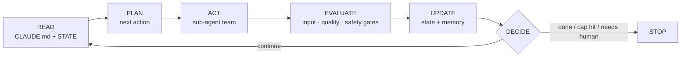

<div align="center">

# 🛰️ Orbit

### Stop prompting your agent. Build a system that prompts itself.

Orbit turns any product repo into a **self-prompting agentic loop** — persistent memory,
a specialized sub-agent team, packaged skills, and a real run→evaluate→decide loop with
**real brakes**: a PreToolUse hook that blocks catastrophic git commands, iteration/runtime
caps that bind the loop, and token/cost budgets metered on the runner.

One command sets it up. It runs on your own orchestrator. It updates itself.

<br/>


</div>

---

> **"You're not supposed to prompt Claude. You're supposed to build a system that prompts itself."**
> — Daisy Hollman

Right now you **babysit** your AI: re-explaining the project every session, watching it
drift, never quite sure what it's doing — or whether it'll do something it can't undo. Orbit
ends that. It turns your repo into a **system that runs itself**: it remembers, it routes
your work through a small team of specialists that check each other, it shows you who's
doing what **live**, and a **safety hook blocks the catastrophic** (force-push, secrets-branch
push) before it runs. One command sets it up — it reads your repo and asks almost nothing.
(What binds vs. what's advisory is spelled out honestly in [Safety](#safety--what-binds-and-what-doesnt).)

## Install

```bash
git clone --single-branch --depth 1 https://github.com/Abdulaziz-almoshen/orbit.git \
  ~/.claude/skills/orbit && cd ~/.claude/skills/orbit && ./setup
```

`/orbit` is available right away — no restart (it's a live-discovered user skill). Prefer `curl`?
`curl -fsSL https://raw.githubusercontent.com/Abdulaziz-almoshen/orbit/main/install.sh | bash` runs
the exact same clone + `./setup`. More options (marketplace plugin, "let Claude do it") are in
[Install options](#install-options).

> [!IMPORTANT]
> **Pick ONE install path.** Orbit is both a user skill (the clone above) *and* a Claude Code
> marketplace plugin. Installing it **both** ways gives you two copies of `/orbit` that both try to
> load — pick one and stick with it. The clone is the default; the marketplace path is in
> [Install options](#install-options).

## Why you'll care

| Without Orbit | With Orbit |
|---|---|
| Re-explain your project every chat | It **remembers** — goals, decisions, conventions, progress (in `CLAUDE.md` + `STATE.md`) |
| One agent does everything, you catch the mess later | A **team** — plan → build → **safety gate** → **quality gate** — that checks its own work |
| A wall of text; you're not sure what's happening | A **live checklist** of who's working, crossing itself off as it goes |
| It free-edits, force-pushes, maybe breaks your DB | A guard **physically blocks** the catastrophic; irreversible actions are *proposed*, never done alone |
| A crash → it starts over and re-burns tokens | **Checkpointed** — resumes from the last finished step (on the `loop.py` runner / a durable engine; the dev loop restarts the cycle) |
| It does exactly what you typed, bugs and all | It **plans like a senior** — clarifies, challenges weak assumptions, writes a decision brief, proposes a better approach |
| Generic, templated UI that screams "AI made this" | On frontend repos a real **Designer** stands up — a distinctive, on-brand Design Plan, not slop |

You ask for a **task** → it runs the loop. You ask a **question** → it just answers. That split
isn't left to the model's mood: a **router hook classifies every message deterministically and
injects the lane** each turn (the model then executes under it). That's the idea: *a system that
prompts itself*, so you stop hand-holding and start shipping.

## The loop

Every cycle is the same honest shape — and you can watch each step happen:




`DECIDE` is the brake — it runs every cycle and is the only place the loop is allowed to
keep going. Hit an iteration / token / cost / runtime cap, fail a gate too many times, or
reach an explicit "done", and it stops cleanly.

## 👀 Watch it work — see *who's talking*, live

This is the part people love. No black box: at any moment you see **which agent is talking,
what stage it's in, and the checklist crossing itself off** — like watching a small team work.
Every role announces itself; one event stream feeds the views below.

**In Claude Code (default)** — the checklist is built with the native **`TaskCreate` /
`TaskUpdate`** tools (the pinned list your IDE keeps on screen; these replaced the now-default-off
`TodoWrite`). The main orchestrator drives it — each item tagged with the role that owns it and
struck through the instant it finishes. Orbit also mirrors it to `.orbit/tasks.json` every cycle,
so if the task tools aren't called you can still see it via `orbit-status` (below):

```text
  ✔ [orchestrator] plan cycle 1
  ✔ [data]         validate inputs
  ▸ [analyst]      derive candidate output     ← in progress
  ☐ [safety]       gate the output
  ☐ [reviewer]     check vs success criteria
```

**Headless only — your own orchestrator (Gemini, cron, CI)** — there's no chat to pin a
checklist into, so run `scripts/orbit-status --follow` for a live, color-coded dashboard
(press **Ctrl-C** to stop):

```text
🛰  ORBIT — live status   .orbit

Checklist
  ✓ [orchestrator] plan cycle 1
  ✓ [data]         validate inputs
  ▸ [analyst]      derive candidate output
  ○ [safety]       gate the output
  ○ [reviewer]     check vs success criteria

Now  [analyst] act — scoring 412 validated rows

Thread (who said what)
  20:14:02 ✓ [orchestrator] plan: planned 5 tasks for cycle 1
  20:14:09 ▸ [data]         act: fetching + validating inputs
  20:14:15 ✓ [data]         act: 412 rows, schema OK
  20:14:15 ▸ [analyst]      act: scoring 412 validated rows
```

**On the Claude desktop app / claude.ai web** — there's no pinned panel or terminal, so Orbit
**renders the team board inline in chat every cycle** (a compact emoji-colored checklist + who's
working now). It's the one view that shows up everywhere, so you're never staring at a black box.

All three views read **one source of truth** — `.orbit/activity.jsonl` (the who·phase·what event
stream) + `.orbit/tasks.json` (the checklist) — so a web panel or IDE view can plug into the
same stream later with zero loop changes. And when the loop pauses for you, it
says so loudly: `[human] awaiting approval: publish to CMS`.

## What you get

Run `/orbit` in a repo and it audits the project, then scaffolds two layers:

**🧠 Model-agnostic core** — runs on *your* orchestrator (e.g. Gemini), in cron, or in CI:
- `CLAUDE.md` — the single source of truth, read at the start of every cycle
- `.orbit/STATE.md` — mutable working memory (task queue, decisions, blockers)
- `.orbit/roles/*.md` — a specialized sub-agent team any model can adopt
- `.orbit/skills/*.md` — packaged domain knowledge, loaded on demand
- `.orbit/loop.config.json` — the safety contract (caps, gates, checkpoints)
- `.orbit/loop.py` — a reference runner; wire its one `dispatch()` seam to your model
- `.orbit/activity.py` + `scripts/orbit-status` — the **observability layer**: a who·phase·what
  event stream and the live `orbit-status --follow` dashboard (see the "Watch it work" section above)

**🔌 Claude Code adapter** — so the same system runs natively here:
- `.claude/agents/*.md` — the roles as Claude Code subagents
- `.claude/settings.json` hooks — a **router** (`UserPromptSubmit` → classifies every message: task→loop, question→direct) + a **safety wall** (`PreToolUse` → deny/ask on dangerous commands)
- `scripts/ralph_loop.sh` — a fresh-context "Ralph loop" driving headless `claude -p`
- **native TaskCreate/TaskUpdate checklist** — the pinned, auto-crossed-off list, role-tagged per item

**The team** it stands up: a **Dispatcher** that clarifies and challenges the ask, an
**Orchestrator** that plans and delegates, the **specialists** your domain needs (including a
**Designer** on frontend repos), a **Safety gate** with veto power, a **Reviewer gate** that
reviews like a senior engineer — correctness, security, concurrency, migrations, tests,
blast-radius — and **proves** the work (runs the tests, quotes the line) before it counts as
progress, and a **Reporter**. No single agent does everything.

## ✨ Two powers people love

These are what make Orbit feel like a senior teammate instead of an autocomplete — both
provisioned from a reusable **skill library** (`references/playbooks/`) that the system
loads into the right role on demand, and that grows over time.

### 🧠 It plans — and pushes back

Orbit doesn't execute your prompt literally. Before it builds, it acts like a thoughtful
senior engineer + a sharp CEO in the same room:

- **Clarifies first, infer-first.** It reads the repo to answer its own questions, surfaces
  the premises it's assuming, and asks you **only the one gap it genuinely can't infer** —
  never a wall of setup questions.
- **Challenges weak assumptions.** If the ask is narrow, fragile, or about to paint you into
  a corner, it says so — and **proposes 2–3 approaches** with trade-offs instead of quietly
  doing the worse one. It's built to *surprise you* with something more accurate, stable, and
  scalable than what you typed.
- **Writes a decision brief** for real forks: stakes, a completeness score, a recommendation,
  and the net call — then runs a **plan-review** (CEO + engineering lenses, blast-radius,
  "don't boil the ocean") *before* a line of code is written.
- **Escalates instead of guessing.** Hit an ambiguous, high-impact decision? It stops and
  asks rather than improvising something irreversible.

> Playbooks: `planning-and-decision-briefs.md` + `clarify-and-challenge.md`.

### 🎨 It designs — distinctively, not generically

When Orbit detects a **frontend/UI repo**, it stands up a dedicated **Designer** sub-agent
(skipped entirely on backend/CLI/data projects — no bloat where you don't need it). The
Designer is loaded with a real design methodology, so your UI doesn't come out looking like
every other AI-generated app:

- **Produces a Design Plan, not ad-hoc CSS** — a named token system (color, type, spacing),
  layout, and **one signature element**, grounded in *your* product's world.
- **Two-pass: plan → critique → build.** Before handing off, it runs a distinctiveness gate —
  *"would a different brief have produced this exact look?"* — and revises until the answer is no.
- **Actively rejects the 3 default "AI aesthetics"** (the warm-cream/serif look, the
  near-black/acid-green look, the broadsheet/hairline look) via an anti-AI-aesthetics checklist.
- **Hands the plan to the Builder; the Reviewer enforces a Design Distinctiveness gate** — the
  shipped UI must match the plan and *not* read like a template.

> Playbooks: `design-methodology.md` + `anti-ai-aesthetics.md`. Self-contained — no external
> design skill required.

## Install options

The [one-command clone](#install) up top is the default. It installs Orbit as a Claude Code **user
skill** — cloned into `~/.claude/skills/orbit`, the same way gstack does it. Claude Code watches that
folder and discovers skills **live**, so `/orbit` and `/orbit-upgrade` work **immediately, no
restart**. Updates are a fast `git pull` (`/orbit-upgrade`).

### As a marketplace plugin (the other path — don't combine with the clone)

```text
/plugin marketplace add Abdulaziz-almoshen/orbit
/plugin install orbit@orbit
```

Same Orbit, installed as a plugin instead of a user-skill clone. **Use this *or* the clone, never
both** — two copies of `/orbit` will collide. The clone is easier to self-update (`/orbit-upgrade`
is a `git pull`); the plugin updates through Claude Code's plugin manager.

### Or let Claude do it — paste this prompt

```text
Install Orbit: run

  git clone --single-branch --depth 1 https://github.com/Abdulaziz-almoshen/orbit.git ~/.claude/skills/orbit && cd ~/.claude/skills/orbit && ./setup

Confirm /orbit is available (no restart — it's a user skill). Then ask me whether to set Orbit
up in this project; if yes, run /orbit. Don't commit anything to my repo without showing me.
```

## Use

**Set it up once** — in the product repo, run:

```text
/orbit
```

It **reads your repo to characterize the domain itself** (stack, goal, what's risky) and
asks **at most one** product question — usually **none** on an existing repo; it only asks
on a blank/greenfield project where there's nothing to infer. Then it scaffolds the system
and installs the routing rule.

**After that, it's a task router.** A rule in your `CLAUDE.md` (read every session) tells
Claude to:
- **route a *task*** ("add a logout button", "fix this bug", "port this screen") **through
  the loop** — read state → plan → act via the roles → gates → update — or you can kick one
  off explicitly with **`/orbit:orbit-run <task>`**;
- **answer a *question*** ("is the project live?", "what does X do?") **directly**, no loop.

This is what "a system that prompts itself" means: the plugin drives the next step, you're
not feeding it one prompt at a time.

> **Honest about what binds:** the routing rule is **advisory** — Claude follows it, but no
> tool can *force* a workflow to run on a given message (gstack's routing is advisory too).
> The one thing that truly **binds** is the optional §6a **safety hook** (it blocks/asks
> before dangerous commands, in or out of the loop). So: routing = reliable discipline,
> safety hook = the hard wall. For unattended/multi-step runs, launch the loop yourself
> (`scripts/ralph_loop.sh`, dev) or a durable engine (production).

### Dev runner vs. durable production

A loop that can't survive a restart isn't a loop — it re-fetches, re-calls the model
(re-burning tokens), and can double-fire side effects. So be honest about the two runners:

- **`scripts/ralph_loop.sh` — dev.** Fresh `claude -p` per cycle; great for building and
  watching. **Not durable:** a crash restarts the cycle.
- **A durable engine — production.** Run on Inngest / Temporal / Vercel Workflow for step
  checkpointing, retries, `onFailure`, cron/event triggers, and concurrency. `loop.py` adds
  portable checkpointing (`--resume`); the seam and a reference template
  ([`assets/runners/inngest-loop.ts`](assets/runners/inngest-loop.ts)) are
  included. Orbit brings the **system design + safety + onboarding**; the engine brings the
  **durability** — don't reinvent it. See
  [`durable-execution.md`](references/durable-execution.md).

> Vocabulary note: Orbit's `.orbit/skills/*.md` are **knowledge playbooks** (reference a role
> loads), distinct from a "durable skill" (a retryable workflow on the engine).

## Self-update

Every time you run `/orbit`, a preamble quietly checks GitHub for a newer version (throttled
to once a day). **Auto-upgrade is on by default** — if there's a newer version it pulls it
(`git pull`, no restart), announces what changed, and continues. You stay current hands-off. Or:

```text
/orbit-upgrade               # upgrade on demand — fetches latest + "what's new", no restart
```

Prefer to upgrade manually? Add `auto_upgrade=false` to `~/.orbit/config` — then `/orbit` just
tells you a new version is available and waits for you to run `/orbit-upgrade`.

> **Scope of an update:** upgrading changes the **plugin only**. The `CLAUDE.md`, roles, and
> loop files a previous run wrote into a product repo are *that project's files* and are never
> touched. To pull template improvements into an existing project, re-run `/orbit` — it
> merges, it doesn't clobber.

## Safety — what binds, and what doesn't

Be clear-eyed about where the guarantees are:

Not everything Orbit does binds equally. Here's the honest breakdown — the line between a
guarantee and a suggestion:

| Layer | Status | What it is |
|---|---|---|
| **Safety wall** (`PreToolUse` → `guard.py`) | ✅ **binds** | Blocks force-push / secrets-branch push, asks before a plain push — *before* the tool runs, model has no say. Splits `cd x && git push --force`, recurses `sh -c`. (Verified against the real harness; covered by `tests/test_guard.py`.) |
| **Iteration + runtime caps** (`ralph_loop.sh`) | ✅ **binds** | The loop physically stops at the cap. |
| **Token + cost budgets** | ✅ **binds on the runner** | `ralph_loop.sh` meters `claude -p --output-format json`; `loop.py` tracks + persists spend across `--resume`. `move_money` is `FORBIDDEN` (raises). |
| **Router classification** (`UserPromptSubmit` → `route.py`) | ⚖️ **system decides, model executes** | A deterministic keyword classifier picks the lane (task→loop / question→direct) and injects it every turn — that call is the system's. But the model still *runs* the loop; a hook can't spawn the sub-agents itself. |
| **Roles, playbooks, the review/QA gates** | 📋 **advisory** | Prompt-driven discipline the model follows reliably — strong, but not mechanically enforced. |
| **`loop.py dispatch()`** (your own-model path) | 🔌 **stub** | An honest seam: raises until you wire it to Gemini/etc. The Claude Code subagent path is what works today. |

Both hooks **fail open** — a bug never bricks your shell or blocks a prompt. `/orbit` wires them by
default and tells you exactly what it added; everything is removable with `orbit-uninstall` (or the
full path `~/.claude/skills/orbit/bin/orbit-uninstall` if it isn't on your PATH — `./setup` symlinks
it into `~/.local/bin` when that's on your PATH).

## Repo layout

```
orbit/                          ← this repo == the skill dir (clones to ~/.claude/skills/orbit)
├── SKILL.md                    # the /orbit skill (at the root, the gstack way)
├── setup                       # post-clone finisher (chmod + expose sub-skills)
├── install.sh                  # curl wrapper: clones + runs ./setup
├── VERSION                     # single source of truth for the version
├── CHANGELOG.md                # what "what's new" reads from
├── bin/
│   ├── orbit-update-check      # prints UPGRADE_AVAILABLE / JUST_UPGRADED / nothing
│   └── orbit-uninstall         # removes the Orbit scaffold from a product repo
├── references/                 # methodology, templates, roles, loop design, observability,
│                               #   hooks/enforcement, profiles, playbooks (the skill library)
├── assets/                     # loop.py, loop.config.json, activity.py, ralph_loop.sh,
│                               #   orbit-status, checks/guard.py + route.py, role adapters
├── scripts/scaffold.py         # lays down the deterministic skeleton (Phase 2)
├── orbit-upgrade/SKILL.md      # the self-update flow (git pull)
└── evals/                      # test cases (for contributors)
```

## Releasing a new version

1. Make changes, bump `VERSION` (the update checker compares it against GitHub), add a
   `CHANGELOG.md` entry.
2. `git push` to `main`. Installed users get the offer on their next `/orbit`, or immediately
   via `/orbit-upgrade` (a `git pull`).

## License

MIT © [Abdulaziz Almohsen](https://github.com/Abdulaziz-almoshen)

<div align="center">
<br/>
Built on Daisy Hollman's "build a system that prompts itself." Now go put something in orbit. 🛰️
</div>
