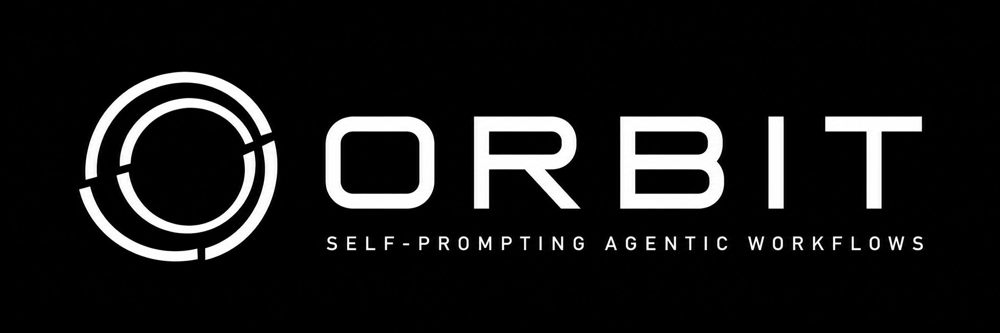
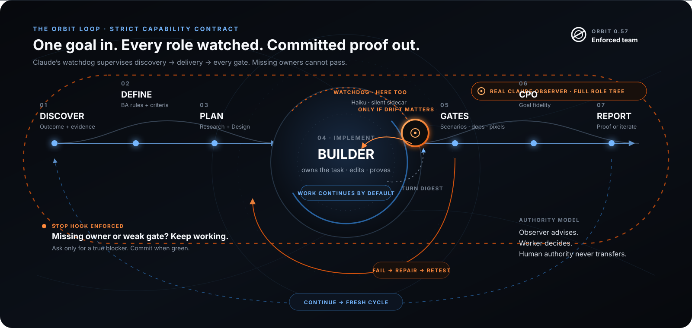

<p align="center">
  
</p>

<div align="center">

# Orbit

### Stop prompting your agent. Build a system that prompts itself.

#### Give Orbit the goal. It runs every specialist, watches every role, proves the result, and commits it.

Orbit turns a product repository into a durable, observable agentic loop: it remembers the work,
plans the next move, delegates focused tasks, **watches the full role tree live for drift**, checks the
result, repairs failures, and returns a proven local commit—interrupting only for true blockers.


</div>

## Why Orbit

Most agent sessions forget context, repeat failed work, and leave you watching a black box. Orbit
gives the work a durable operating system:

- **Memory:** project goals, decisions, conventions, and progress persist in `CLAUDE.md` and `.orbit/STATE.md`.
- **Plan and progress:** every run has a visible checklist, owner, phase, gate, and next action.
- **Enforced capabilities:** substantial work must complete Product Discovery, Business Analysis,
  Market Research, Planning, Safety, Reviewer, QA, CPO, and Reporting; UI work must also complete
  Design. The Stop hook blocks missing owners. Mentioning a role or using it as a private “lens”
  does not satisfy the contract.
- **Iterative quality:** failures become evidence-backed repair packets and return to the loop.
- **Independent QA:** an opt-in second provider reviews an exact commit against an armed acceptance
  manifest; code or manifest changes invalidate the approval.
- **CPO acceptance:** after QA proves the work was built right, a CPO role judges whether the *right
  thing* was built — the deliverable against your original goal. The run cannot finish without a
  commit-bound `ACCEPT`; `ITERATE`/`REDEVELOP` verdicts return the work with change orders, and every
  verdict grows a per-project user-model (`.orbit/skills/user-model.md`) so each iteration lands
  closer to what you actually want.
- **Reviewer choice:** install-time detection offers Codex, isolated Claude QA, or both. Missing providers
  block instead of silently weakening the gate; the choice never grants project export consent, and
  Arabic/RTL QA follows the project, not the provider.
- **Adversarial thinking:** a cheap counterfactual probe challenges risky assumptions before build.
- **Model discipline:** Sonnet handles normal work; the Opus 4.8 Advisor is invoked on demand for
  expensive decisions.
- **Cost control:** token, dollar, runtime, context, iteration, and fan-out limits are explicit.
- **Parallel work:** independent workers use isolated Git worktrees instead of fighting over one checkout.
- **Full-loop Claude observer:** every operational role and propagated descendant—Discovery, BA,
  Research, Planner, Design, Build, Safety, Reviewer, QA, CPO, and Reporter—is paired with the silent
  watchdog. Its state is visible as `armed`, `watching`, `intervention`, or `clean` without replacing
  the active owner.
- **Autonomous delivery:** reversible product and engineering decisions are Orbit's job. It asks only
  for missing access, human authority over irreversible/external actions, or an expensive product fork
  that evidence cannot resolve. Green work is returned as a scoped local commit with proof.
- **Non-interactive Bash safety:** routine commands—including normal push/merge—proceed without a
  hook prompt. Catastrophic commands are hard-denied; risky or uninspectable commands are denied
  rather than pausing for confirmation. The `PreToolUse:Bash` hook never emits `ask`.
- **Always-on routing:** a deterministic hook classifies every message before the model sees it.
  In the default `always` mode each real request engages the loop and every reply opens with a
  visible `⏣ orbit` lane marker — you always see Orbit take the request. Acks and "don't…"
  messages stay silent; set `router.mode: "smart"` for conservative routing.

## The loop

<picture>
  
</picture>

> **New in Orbit 0.56:** the orange watchdog is no longer builder-only or hidden. Claude’s real
> observer attaches to every operational role, propagates through descendants, and exposes a separate
> supervision state on Orbit’s status and dashboard. Orbit also defaults to autonomous delivery:
> no spec, taste, or budget-reassurance questions inside configured limits; green work is committed.

> **New in Orbit 0.50:** the **CPO** closes the loop's last gap. The gate chain is now
> Safety → Reviewer → QA Engineer → Independent QA (opt-in) → **CPO acceptance** → done. Every
> earlier gate verifies the build against artifacts the system wrote for itself; the CPO is the
> user's proxy — it re-anchors on the goal you actually stated, returns the deliverable
> (`ITERATE`/`REDEVELOP`) when the goal isn't served, and records what it learns about your
> taste in a per-project user-model that every later run inherits.

> **New in Orbit 0.55:** the complete team is enforceable. Every substantial run follows the
> mandatory spine below, with actual post-route completion evidence from each named role. Lite mode
> runs it sequentially; approval changes concurrency, never coverage.
>
> `Discovery → Business Analysis → Market/Prior Art → Plan → [Design for UI] → Build → Safety →
> Reviewer → QA → CPO → Reporter`

Three controls make the loop meaningfully safer and iterative:

1. **Counterfactual preflight:** identify the riskiest assumption, run the cheapest useful probe,
   and backtrack to discovery or planning when evidence disagrees.
2. **Full-loop observer:** inspect discovery quality, analysis, planning, implementation, every gate,
   and reporting for drift, stalled/repetitive work, rubber-stamping, or unsupported proof. Healthy
   work produces no advisory, but its watcher state remains visible.
3. **Bounded repair:** capture the failure, owner, root cause, required change, and regression test;
   repair it and return to the original gate. Repeated failure escalates to Advisor or a human.

### Why the observer matters

| Without live observation | With Orbit 0.56 |
|---|---|
| Weak discovery or a wrong approach may travel through the loop. | The watchdog can flag generic ideas, missing evidence, or delivery drift at the role where it begins. |
| The worker must remember every constraint while optimizing for completion. | A separate Haiku observer has one narrow job: notice compounding mistakes. |
| Test weakening may only appear in the finished diff. | Attempts to skip, weaken, delete, or reverse-engineer tests can be challenged immediately. |
| More code and tokens accumulate before repair begins. | One early advisory can avoid an expensive downstream repair cycle. |

The expected steady state is silence. The observer is a **drift tripwire**, not another worker and
not a security boundary; Safety, Reviewer, QA, approval checkpoints, and hard limits still decide
whether the result may proceed.

## Install

Choose one installation path. Do not install both the clone and marketplace plugin.

```bash
git clone --single-branch --depth 1 https://github.com/Abdulaziz-almoshen/orbit.git \
  ~/.claude/skills/orbit
cd ~/.claude/skills/orbit && ./setup
```

Or:

```bash
curl -fsSL https://raw.githubusercontent.com/Abdulaziz-almoshen/orbit/main/install.sh | bash
```

Then open a product repository and run `/orbit`. The preamble checks for updates and quietly repairs
safe scaffold drift: it adds missing Orbit-owned files, preserves custom files and disabled hooks,
and skips projects under an active writer lock.

## Command map

| Command | Purpose |
|---|---|
| `/orbit` | Scaffold a project or merge safe template updates. |
| `/orbit:orbit-run <task>` | Force a task through the governed loop. |
| `scripts/orbit-status --follow` | Follow agents, checklist, gates, budget, and confidence. |
| `scripts/orbit-dashboard --once` | Print the redacted status snapshot; `--port N` serves a read-only board. |
| `scripts/orbit-pet start` | Show the always-on-top macOS pet that narrates tasks, questions, QA, commits, and deployment. |
| `scaffold.py --enable-reporter` | One-time trusted-project activation: hooks, terminal QA scene, local board, and macOS pet. |
| `scripts/orbit-qa-hook install` | Opt in to automatic post-commit QA and the exact-commit pre-push gate after project approval. |
| `orbit-doctor` | Inspect scaffold drift; `--fix` applies only safe managed-hook refreshes. |
| `scripts/orbit-lock status` | Inspect the current checkout lease. |
| `scripts/orbit-lock takeover --reason "..."` | Atomically break, acquire, and verify a handoff. |
| `scripts/orbit-worktree create --task <slug>` | Create an isolated worker branch and checkout. |
| `scripts/orbit-worktree finish <worktree>` | Submit changed files, tests, summary, and budget to the merge queue. |
| `scripts/orbit-memory review` | Review the learning ledger before promoting anything durable. |
| `/orbit-upgrade` | Upgrade the installed plugin. |

## Parallel work

The coordinator owns the plan, integration branch, `STATE.md`, and final QA. Workers write in separate
branches:

```text
Coordinator: plan -> integrate -> verify
     |-- orbit/task-a  -> worker + private worktree
     `-- orbit/task-b  -> worker + private worktree
```

Each worker receives a bounded token/USD reservation and returns a completion packet. The shared
registry lives in Git's common directory; each worktree has its own local Orbit lease. This means
parallel sessions are normal without allowing two sessions to edit the same checkout.

```bash
scripts/orbit-worktree create --task concierge-fix
scripts/orbit-worktree status
scripts/orbit-worktree finish ../project-orbit-concierge-fix \
  --summary "Implemented and tested the concierge fix" \
  --tests "pytest -q"
```

The coordinator reviews the packet, resolves conflicts, runs integration QA, and merges. Orbit does
not silently merge worker branches.

## Live visibility

Orbit is designed to be watched without reading a wall of model prose:

```text
Orbit  |  Build  |  3/8 complete  |  1 active  |  budget $0.42/$1.25

> frontend-engineer  building the requested slice
  reviewer            queued: checks regressions
  safety-gate         queued: confirms approval boundaries
```

In Claude Code, the native checklist is the primary surface. In headless or portable runs, use
`scripts/orbit-status --follow` or the read-only dashboard.

## Observer agents: real, full-loop, and visible (experimental Claude capability)

Orbit's Claude Code adapter automatically pairs every operational role and descendant with
`.claude/agents/watchdog.md`:

```text
Discovery → BA → Research → Plan → Design → Build → Safety → Review → QA → CPO → Report
    │               each role + propagated descendants: read-only activity digest              │
    └──────────────────────────────▶ Watchdog (Haiku) ───────────────────────────────────────────┘

No finding = no message. The worker continues uninterrupted.
```

The watcher sees Claude Code's truncated, read-only activity digest and stays silent unless a short
advisory can prevent shallow discovery, stalled work, scope drift, weakened tests, rubber-stamped
gates, or unsupported proof. It cannot edit,
block the worker, or grant user authority, and it does not replace the final Reviewer or QA gates.

Every scaffold and safe update enables the project-scoped experiment, installs a missing watchdog,
and additively wires every existing Orbit role without replacing customized role bodies. Explicit env
values and existing alternate observers are preserved. To enable it manually, launch Claude Code with:

```bash
CLAUDE_CODE_EXPERIMENTAL_OBSERVER_AGENTS=1 claude
```

This Claude capability remains undocumented, experimental, and remotely gated; Orbit cannot honestly
guarantee that Anthropic's server enables it. Orbit does guarantee the project setting, agent
frontmatter, descendant propagation, additive update repair, visible `observer.json` state, and
regression tests. When Claude withholds the capability, roles continue and the final gates still bind.

## What binds

| Capability | Guarantee |
|---|---|
| Safety wall | Trusted Bash guard is non-interactive: routine commands allow, catastrophic commands deny, and no `ask` confirmation is ever emitted. |
| Writer lease | One writer per checkout; reads remain available. `takeover` verifies the new owner before writes resume. |
| Worktree isolation | Separate workers can write concurrently in separate Git worktrees. |
| Runtime and budget caps | `ralph_loop.sh` and `loop.py` enforce iteration, runtime, token, and dollar limits. |
| Checkpointing | Durable runner state persists budget and progress across resume. |
| Telemetry | Hooks observe and redact activity; they fail open and never block work. |
| Capability completion | Strict Stop contract blocks substantial work when a mandatory role has no completed post-route event; UI projects additionally require Designer. |

Role activation is mechanically checked; the quality of discovery, analysis, design, and review
judgment remains model-governed. Advisor invocation and the portable runner's model `dispatch()` seam
also remain model-governed. The
Claude Code path is the complete default path; wire `dispatch()` before using `loop.py` with another
orchestrator.

## Model and cost policy

Orbit Lite is the default:

- mandatory stage owners run sequentially, one at a time;
- maximum two isolated workers by default;
- focused packets instead of full repository history and telemetry;
- the Sonnet Executor lane for ordinary work;
- one Opus Advisor call for an architectural fork, safety uncertainty, or repeated gate failure;
- explicit per-cycle and per-run token, dollar, runtime, and context limits.

Approval is required to widen concurrency, not to activate the required team. The goal is complete
accountability without uncontrolled fan-out.

## Frontend projects

UI repositories receive a mandatory Designer stage, a 67-style design catalog,
prototype-before-build guidance, and visual QA helpers. A substantial UI run cannot stop without a
completed Designer event. The design gate also records the chosen direction and asks when a UI
change has no design decision on record; visual judgment itself remains human/model work.

## Self-update

```text
/orbit-upgrade
```

The installer reports the resolved commit and version. Project scaffolds are separate snapshots; the
automatic preamble refreshes only safe Orbit-owned drift and never overwrites custom project files.

For a manual install refresh:

```bash
cd ~/.claude/skills/orbit
git fetch origin
git reset --hard origin/main
./setup
```

## Repository layout

```text
bin/                  trusted commands and hooks
assets/               scaffolded engines, checks, agents, and wrappers
references/           playbooks, role specs, and templates
scripts/scaffold.py   deterministic project provisioning and migration
tests/                regression, safety, budget, and lifecycle tests
```

## Development

```bash
bash tests/run.sh
python3 scripts/check-coherence.py
python3 bin/orbit-verify --root .
```

Before a release, bump `VERSION`, add a `CHANGELOG.md` entry, regenerate `checksums.txt`, and run the
full suite. The current channel is an unsigned development channel; checksum verification detects
modification but is not a cryptographic signature.

## License

MIT
